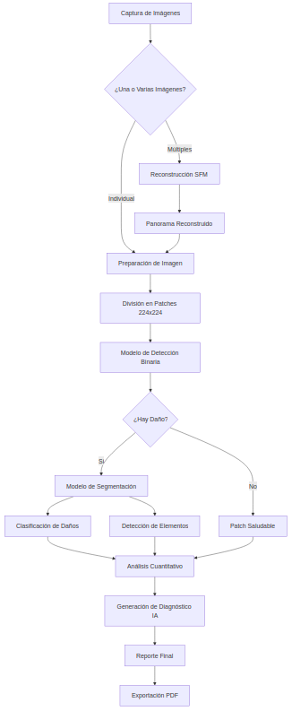

# Deteccion de Daños en Fachadas Coloniales
Detección de Daños Exteriores en Edificaciones Patrimoniales de Sucre por Visión por Computadora
Nombre: Priscila Ximena Arduz Limpias
Carrera: Ingeniería en Ciencias de la Computación
Universidad: Universidad Mayor Real y Pontificia de San Francisco Xavier de Chuquisaca


## 📋 Explicación del Proyecto

Este proyecto utiliza **inteligencia artificial** y **visión por computadora** para detectar y diagnosticar automáticamente daños estructurales en las fachadas de edificios coloniales de Sucre, Bolivia. El software combina técnicas avanzadas de **Structure from Motion (SFM)**, **deep learning** y **procesamiento de imágenes** para proporcionar análisis detallados y diagnósticos precisos del estado de conservación patrimonial.

### 🎯 Objetivo Principal
Preservar el patrimonio arquitectónico colonial mediante la detección temprana y clasificación automática de daños estructurales, facilitando la toma de decisiones para intervenciones de conservación.

### 🏗️ Arquitectura del software

```
┌─────────────────┐    ┌──────────────────┐    ┌─────────────────┐
│   FRONTEND      │    │    BACKEND       │    │   MODELOS IA    │
│   (Flutter)     │◄──►│   (FastAPI)      │◄──►│   (PyTorch)     │
│                 │    │                  │    │                 │
│ • Captura       │    │ • API REST       │    │ • Detección     │
│ • Preview       │    │ • Procesamiento  │    │ • Segmentación  │
│ • Resultados    │    │ • SFM           │    │ • Clasificación │
└─────────────────┘    └──────────────────┘    └─────────────────┘
                              │
                              ▼
                    ┌──────────────────┐
                    │   DIAGNÓSTICO    │
                    │   (LangChain +   │
                    │    GPT-3.5)      │
                    └──────────────────┘
```

### 🔍 Tipos de Daños Detectados

El software está entrenado para identificar **10 tipos específicos** de daños comunes en arquitectura colonial:

| Tipo de Daño | Descripción | Elementos Afectados |
|--------------|-------------|-------------------|
| **Deformación** | Abultamientos y irregularidades en revestimientos de piedra | Bases de muros, zócalos |
| **Desprendimiento** | Pérdida de revoque y materiales de acabado | Muros, superficies |
| **Deterioro** | Desgaste y degradación de materiales orgánicos | Puertas, ventanas de madera |
| **Ensanchamiento** | Aumento anormal del grosor de elementos estructurales | Paredes, bases de muros |
| **Filtración** | Manchas verticales por infiltración de agua | Muros exteriores |
| **Fisuración** | Grietas superficiales con patrones geométricos | Revoques, acabados |
| **Grietas** | Fisuras profundas y estructurales | Elementos portantes |
| **Humedad** | Manchas eflorescentes y oscurecimiento | Muros, bases |
| **Humedad Interna** | Patrones de porosidad y deterioro interno | Revoques, acabados |
| **Hundimiento** | Deformación por gravedad | Techos, cubiertas |

### 🔄 Flujo de Procesamiento



## 🚀 Instalación y Configuración

### Prerrequisitos
- **Python 3.8+**
- **Flutter 3.0+**
- **CUDA** (recomendado para GPU)
- **OpenAI API Key** para diagnósticos

### Backend (FastAPI)

```bash
# 1. Clonar el repositorio
git clone <repository-url>
cd facade-damage-detection

# 2. Crear entorno virtual
python -m venv venv
source venv/bin/activate  # Linux/Mac
# o
venv\Scripts\activate     # Windows

# 3. Instalar dependencias
pip install -r requirements.txt

# 4. Configurar variables de entorno
export OPENAI_API_KEY="tu-api-key-aqui"

# 5. Ejecutar servidor
uvicorn app:app 
```

### Frontend (Flutter)

```bash
# 1. Navegar al directorio frontend
cd frontend

# 2. Instalar dependencias
flutter pub get

# 3. Configurar endpoint del backend
# Editar lib/config/api_config.dart

# 4. Ejecutar aplicación
flutter run
```

## 📁 Estructura del Proyecto

```
facade-damage-detection/
├── 📄 app.py                          # API principal FastAPI
├── 📁 models/
│   ├── 📄 model_utils.py              # Carga de modelos
│   ├── 📄 all_models_2.py             # Procesamiento con IA
│   ├── 📄 langchain_results.py        # resultados de los modelos listos para mandarlos al llm
│   └── 📄 visualize_results.py        # Visualización de resultados
├── 📁 utils/
│   ├── 📄 image_processing.py         # Procesamiento de imágenes
│   └── 📄 resize.py                   # Redimensionamiento adaptativo
├── 📁 sfm/
│   └── 📄 proyectosfmvariasimagenes.py # Algoritmos SFM
├── 📁 langchain_integration/
│   ├──docs/
│   │   ├──patologiasFachadas.pfg      # pdf con informacion para crear embeddings
│   ├── 📄 init_langchain.py           # software de diagnóstico IA
│   └── 📄 init_langchain.py           # software de diagnóstico IA
├── 📁 frontend/
│   ├── 📁 lib/
│   │   ├── 📁 screens/
│   │   │   ├── 📄 image_analysis_screen.dart    # Pantalla principal
│   │   │   └── 📄 analysis_results_screen.dart  # Resultados
│   │   ├── 📁 services/
│   │   │   └── 📄 image_analysis_service.dart   # Servicio API
│   │   ├── 📁 models/
│   │   │   └── 📄 analysis_result.dart          # Modelos de datos
│   │   └── 📁 widgets/
│   │       ├── 📄 image_preview.dart            # Preview imágenes
│   │       └── 📄 processed_image.dart          # Imágenes procesadas
│   └── 📄 pubspec.yaml                # Dependencias Flutter
└── 📄 requirements.txt               # Dependencias Python
```

## 🔧 Descripción de Archivos Principales

### Backend (FastAPI)

#### `app.py` - Servidor Principal
```python
# Funcionalidades principales:
• Configuración CORS para conexión frontend-backend
• Carga automática de modelos IA al inicio
• Endpoints REST para análisis de imágenes
• Manejo de errores y logging detallado
```

**Endpoints Disponibles:**
- `POST /analyze/multiple` - Análisis de múltiples imágenes con SFM
- `POST /analyze/single` - Análisis de imagen individual
- `GET /health` - Verificación de estado del software
- `POST /test/echo` - Endpoint de prueba

#### `models/all_models_2.py` - Núcleo de IA
```python
# Componentes clave:
• improved_load_and_analyze_facade() - Análisis principal
• generate_damage_analysis_improved() - Cuantificación de daños
• ImprovedConfig - Configuraciones adaptativas
```

#### `sfm/proyectosfmvariasimagenes.py` - Reconstrucción 3D
```python
# Pipeline SFM:
• detectar_caracteristicas() - SIFT/ORB features
• encontrar_correspondencias() - Matching de puntos
• estimar_homografias() - Transformaciones geométricas
• crear_mosaico() - Construcción del panorama
```

### Frontend (Flutter)

#### `image_analysis_screen.dart` - Interfaz Principal
```dart
// Componentes UI:
• Selección de imágenes (galería/cámara)
• Formularios de metadatos
• Indicadores de progreso
• Navegación a resultados
```

#### `image_analysis_service.dart` - Comunicación API
```dart
// Servicios principales:
• pickImages() - Selección múltiple
• takePicture() - Captura directa
• analyzeImages() - Llamadas HTTP al backend
```

## 🧠 Modelos de Inteligencia Artificial

### 1. Modelo de Detección Binaria
- **Arquitectura**: CNN personalizada
- **Input**: Patches 224x224 píxeles
- **Output**: Probabilidad de daño (0-1)
- **Propósito**: Filtrado inicial de áreas dañadas

### 2. Modelo de Segmentación
- **Arquitectura**: U-Net modificada
- **Input**: Patches con daño detectado
- **Output**: Máscaras de segmentación por tipo de daño
- **Clases**: 10 tipos de daño 

### 3. Modelo de Detección de Elementos
- **Arquitectura**: CNN personalizada
- **Input**: Patches 224x224 píxeles
- **Output**: Elemto detectado
- **Propósito**: Detección de elementos arquitectónicos

### 4. Software de Diagnóstico (LangChain + GPT-3.5)
- **Input**: Análisis cuantitativo + metadatos
- **Output**: Diagnóstico detallado y recomendaciones
- **Conocimiento**: Base de datos de patologías arquitectónicas

## 🔍 Uso del software

### 1. Análisis de Imagen Individual
```bash
curl -X POST "http://localhost:8000/analyze/single" \
     -H "Content-Type: application/json" \
     -d '{
       "image": "base64_encoded_image",
       "ubicacion_exacta": "Plaza 25 de Mayo",
       "epoca_construccion": "Siglo XVIII",
       "uso_actual": "Residencial",
       "ultima_intervencion": "2020"
     }'
```

### 2. Análisis de Múltiples Imágenes
```bash
curl -X POST "http://localhost:8000/analyze/multiple" \
     -H "Content-Type: application/json" \
     -d '{
       "images": ["base64_image1", "base64_image2", "base64_image3"],
       "ubicacion_exacta": "Calle Arenales",
       "epoca_construccion": "Colonial",
       "uso_actual": "Comercial"
     }'
```

## 📈 Salidas del software

### Análisis Cuantitativo
```json
{
  "damage_analysis": {
    "total_damage_percentage": 15.4,
    "damage_by_type": {
      "humedad": 8.2,
      "fisuración": 4.1,
      "desprendimiento": 3.1
    },
    "elements_affected": {
      "muro": 12.5,
      "base": 2.9
    }
  }
}
```

### Imágenes Generadas
- **Overlay Damage Detection**: Patches detectados con daños sobre la imagen original
- **Overlay Damage Mask**: Máscara de daños detectados superpuesta sobre imagen original con leyenda

### Diagnóstico IA
```
DIAGNÓSTICO ARQUITECTÓNICO

Estado General
Prioridad de Intervención
Principales Patologías Detectadas
Recomendaciones
```

## ⚡ Optimizaciones y Rendimiento

### Compresión Inteligente
- **Algoritmo**: Compresión adaptativa basada en contenido
- **Reducción**: Hasta 80% del tamaño original
- **Calidad**: Preservación de detalles críticos para diagnóstico

### Procesamiento Paralelo
- **GPU Acceleration**: CUDA para modelos de IA
- **Multithreading**: Procesamiento concurrente de patches
- **Memory Management**: Gestión eficiente de memoria para imágenes grandes

### Tiempos de Procesamiento
- **Imagen Individual**: 15-30 segundos
- **SFM (5 imágenes)**: 45-90 segundos
- **Diagnóstico IA**: 5-10 segundos


## Uso de la aplicación:


## Documentos del proyecto:

Artículo científico:


Diapositivas del Proyecto:


## 📄 Licencia

Este proyecto está licenciado bajo MIT License - ver archivo LICENSE para detalles.


---

**Desarrollado para la preservación del patrimonio arquitectónico colonial de Sucre, Bolivia** 🏛️